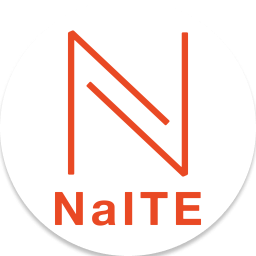
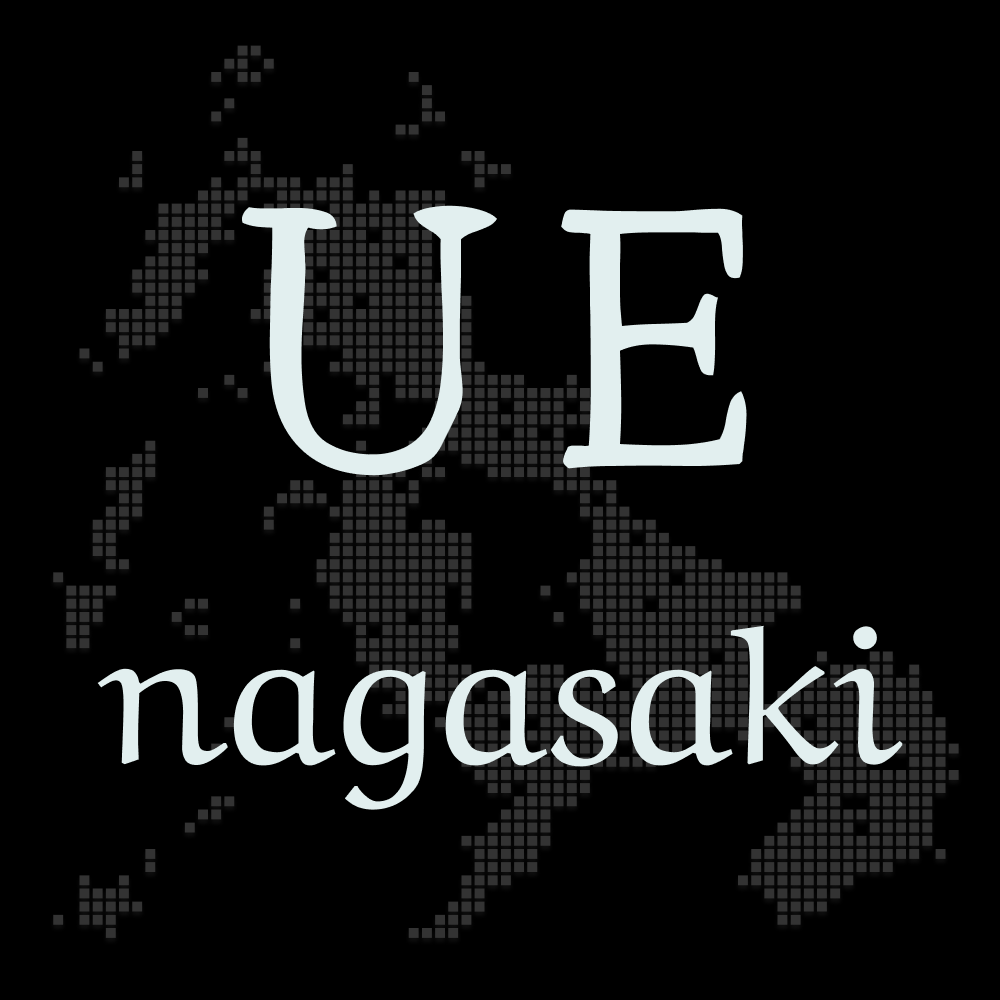
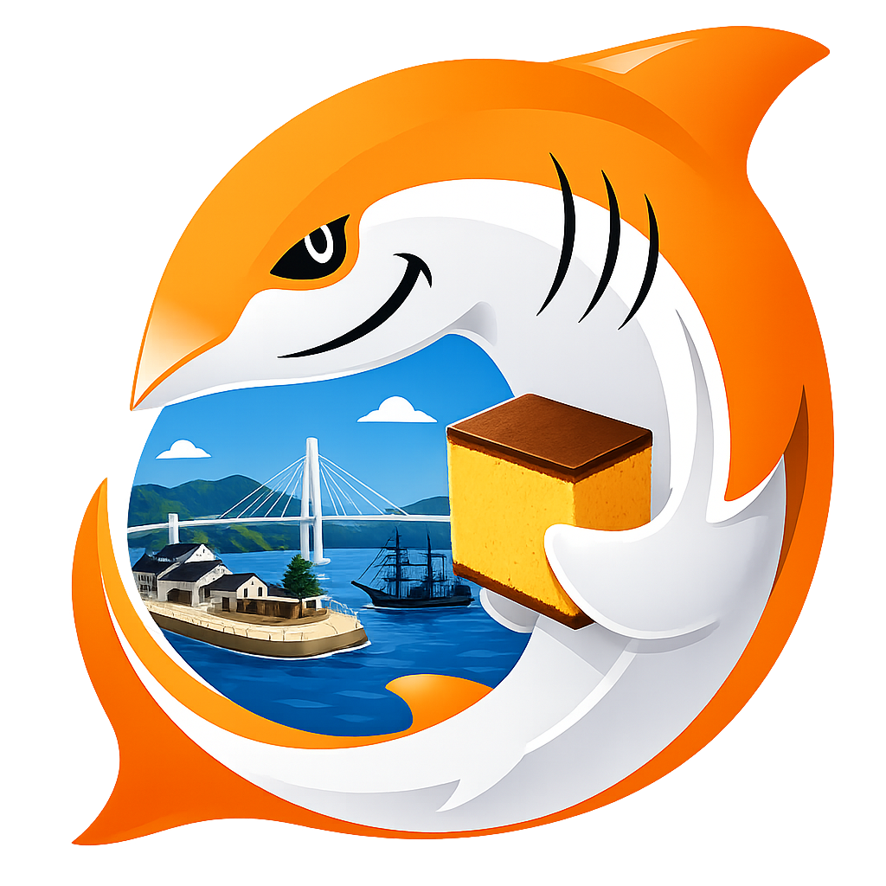

お前誰よ
======================================================================

.. container:: name

    紫苑 (徳久泰河)

.. container:: flex

    .. container:: size-1

        .. figure:: ../shared/_image/avator.jpg
            :alt: 著者近影
            :align: center
            :width: 100%
 
    .. container:: size-2

        * Sion908 (ついった, GitHub, etc) [#portfolio]_
        * 生息地(長崎, ぐんまー)
        * 長崎大学大学院工学研究科電気電子工学 修了
        * 株式会社デザイニウム
        * webアプリケーション, 3DCG, 写真
        * 高校教員免許(数学、工業)
        * NaITE, UE長崎, JAWS-UG長崎

    .. container:: size-1

        
        .. figure:: _imgs/naite.png
            :alt: NaITEロゴ
            :align: center
            :width: 60%

        .. figure:: _imgs/ue_nagasaki.png
            :alt: UE長崎ロゴ
            :align: center
            :width: 60%

        .. figure:: ../shared/_image/jawsug-nagasaki-icon.png
            :alt: JAWS-UG長崎アイコン
            :align: center
            :width: 60%

.. [#portfolio] ポートフォリオ <https://portfolio.sion908.tech/>

株式会社デザイニウム
--------------------------------------------------------------------------------

* 福島県会津若松市
* MaaS,地域通貨を含む、都市OSの一端や、除雪クラウドなどのDX化などを行う
* 東京の拠点では、ARやXRも行っている

.. figure:: ../shared/_image/corp_home.png
    :alt: corp_home
    :align: right
    :width: 1200px 

NaITE (長崎IT技術者会)
--------------------------------------------------------------------------------

* 長崎になんらかの縁や関わり、興味があるIT技術者を中心とした技術コミュニティ
* ソフトウェア品質技術やソフトウェア開発技術の話題を中心に活動
* 勉強会, もくもく会, QDG(Software Quality and Development Gathering), ToCセミナー
* https://nagasaki-it-engineers.connpass.com/
* 次回イベント: 2026.06.26(金) LT会 in リコーITソリューションズ

UE長崎
--------------------------------------------------------------------------------

* Unreal Engineと3D表現に興味を持つ人たちの長崎発クリエイティブ・コミュニティ
* 「島を繋ぎ、長崎を一つのクリエイティブ・ギルドへ」
* UEやメタバースの技術を使って、長崎の島々をつなぐ
* Webサイト: https://ue-ngs.sion908.tech
* 次回イベント: 2026.06.14(土) もくもく会 in coto

JAWS-UG 長崎
--------------------------------------------------------------------------------

* Amazon Web Services（AWS）のユーザーグループ
* AWSに興味がある方、初心者からエキスパートまで幅広い層が集まるコミュニティ
* 基礎的な内容から実践的な活用まで、参加者同士で知見を共有
* Discordサーバーで継続的な交流
* 次回イベント: 2026/06/13(土) AWS BuilderCards 体験会 in CO-DEJIMA
* Webサイト: https://jawsug-nagasaki.connpass.com/

